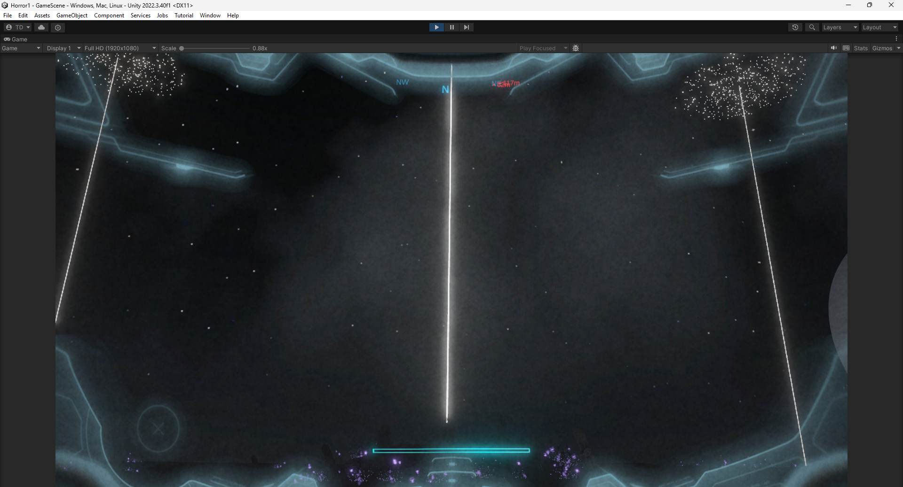
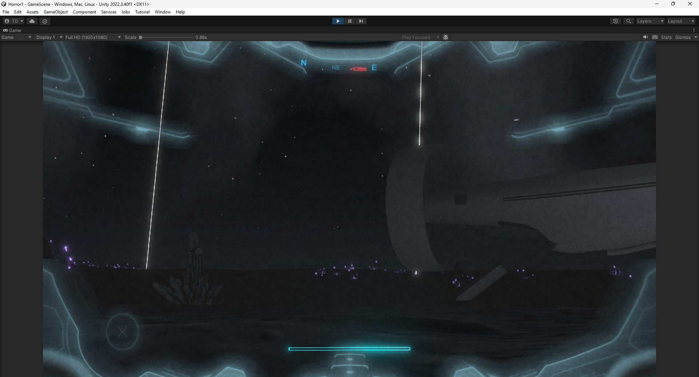
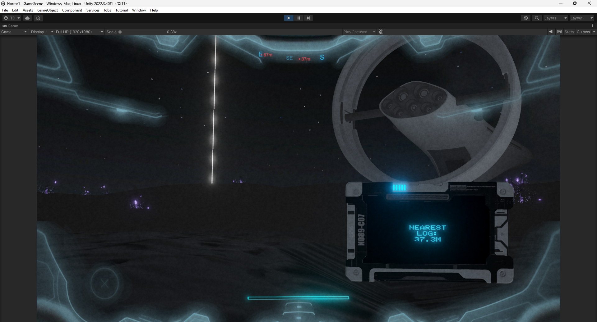
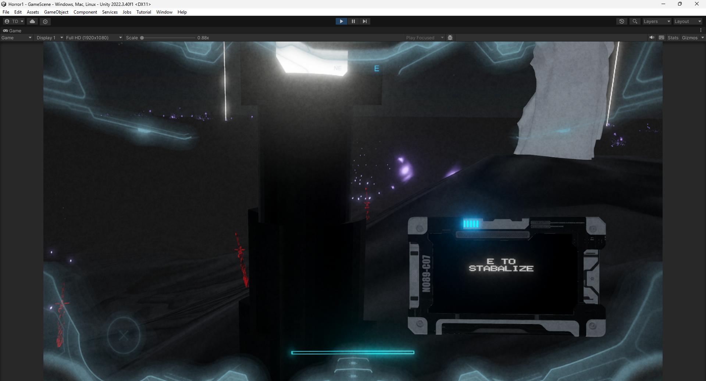
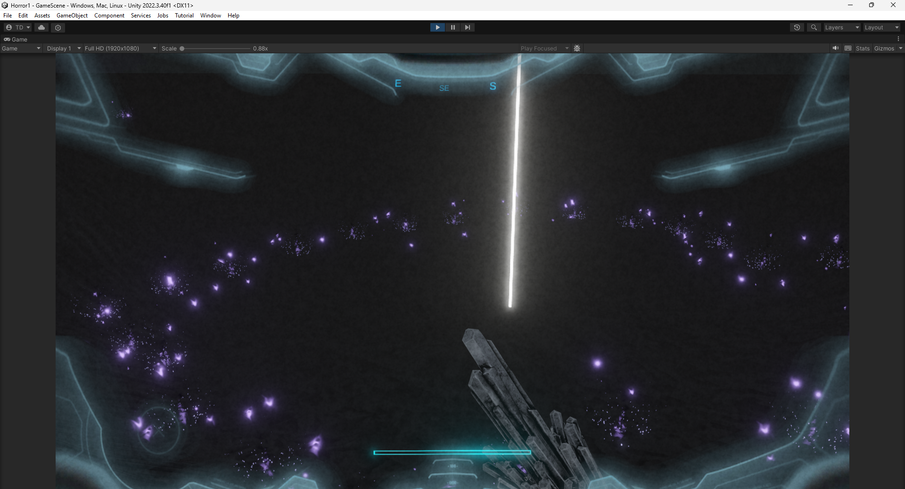
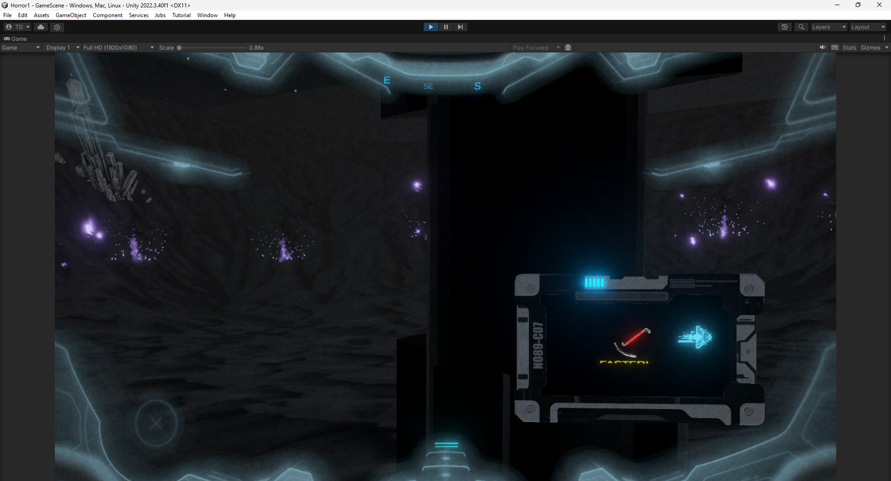
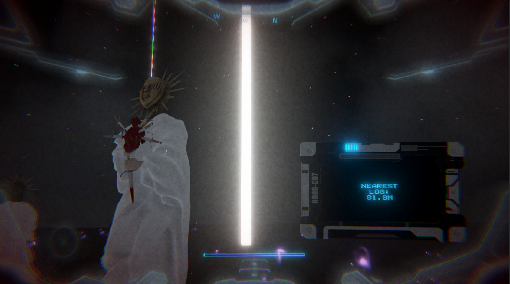
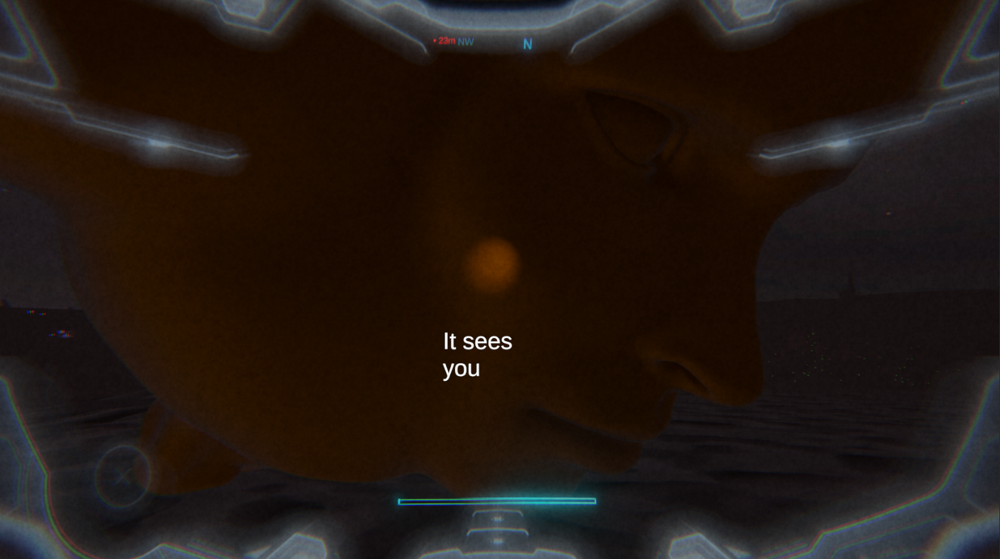

# 👁️ Horror1 *(Working Title)*

**Horror1** is a **psychological survival horror game** developed in **Unity**, set on a mysterious exoplanet.  
Trapped and alone, you must **disable alien beacons** while unraveling the eerie lore hidden within scattered audio logs. But you're **not alone**. A being lurks — unfamiliar, unpredictable, and dangerous.

---

## 🎮 Game Overview

- 🌌 **Setting**: A deserted alien world with an mysterious crystals, fog ridden land and looming silence.
- 📻 **Gameplay**: Use a tablet device to detect and collect **audio logs** that reveal the planet’s secrets.
- 🔦 **Objective**: **Find and disable all beacons** before you're found by the unknown entity.
- 🧠 **Sanity Mechanic**: The more you explore, the more you lose your grip on reality. Keep your sanity low to avoid attracting "it"...
- 👤 **Enemy AI**: IT is there. Looming. Patroling. Yet you cannot percieve it... you dont know when it can appear in front of you, so keep on the run **or** do not run as it can detect you and rush for you!!.

---

## 📷 Screenshots

*The moment just before the enemy arrives...*

---

## 📹 Gameplay Preview

[▶️ Watch the gameplay video](https://www.youtube.com/watch?v=your_video_link)

---

## ⚙️ Built With

- [Unity 2022.3.40f1](https://unity.com/)
- C#
- Unity First Person Starter Asset
- Custom Audio Detection & Sanity System
- Custom Spaceship animations
- Custom particle system for beacons
- Custom compass and pointers at Audiologs
- Custom AudioLog inventory inspired by Subnautica

---

## 🚧 Development Status

The game is currently in its **final development phase** and nearing completion. A playable demo and release build will be added soon.

---

## 📬 Contact

If you're an HR, recruiter, or fellow developer interested in this project:
- [LinkedIn Profile](http://www.linkedin.com/in/t-daranish) 
- [GitHub Profile](https://github.com/DaranishT)

---

> *Thank you for checking out Horror1 — a solo-developed horror experience blending audio, atmosphere, and fear of the unknown.*
